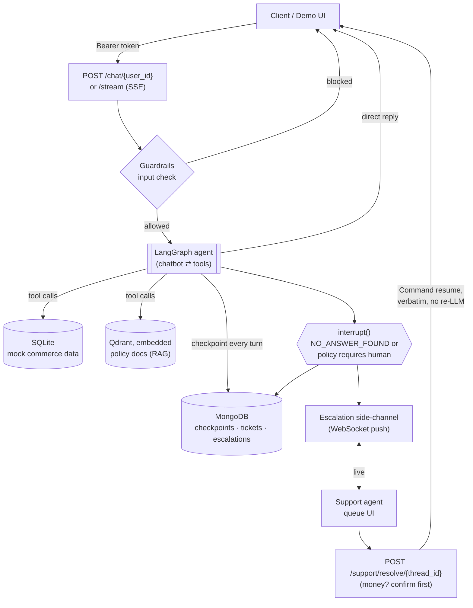

# Support Agent Infra — Durable Human-in-the-Loop AI Support

[](https://github.com/OWNER/REPO/actions/workflows/ci.yml)
<!-- Replace OWNER/REPO with this repo's GitHub path once pushed. -->

A stateful, multi-tenant AI support agent built on LangGraph, with MongoDB-backed
persistence and a real escalation-to-human workflow. The agent looks up a
user's cart, order history, and order status, searches company policy docs,
and pauses execution mid-conversation to hand off to a human — then resumes
exactly where it left off, with full state intact.

This is not a RAG project. It's about the infra problem underneath any AI
support tool: what happens when the model can't or shouldn't answer, and a
human needs to take over without losing context.

No production frontend — the API is the interface (see `/docs`). A minimal
HTML/JS demo lives in `frontend/`, built to make the human-in-the-loop flow
watchable without curl commands (see [Demo](#demo)).

Two companion docs go deeper than this README:
[`REQUEST_FLOW.md`](./REQUEST_FLOW.md) traces every real flow step by step,
with function names, for a normal chat, an escalation, and a resolution.
[`DECISIONS.md`](./DECISIONS.md) documents every non-obvious choice — what
was decided, what else was considered, and what it costs.

---

## Architecture

```
POST /auth/token   [issues a JWT — user or support_agent role]
        │
        ▼
POST /chat/{user_id}   [Bearer token required, rate limited: 15/min per user]
        │
        ▼
   Guardrails input check (NeMo Guardrails) ──► blocked? return refusal,
        │                                        never reaches the agent
        ▼ (allowed)
   LangGraph agent ── tool call ──► get_user_cart / get_order_history / get_latest_order /
        │                            get_order_by_id / check_policy
        │                            (FAQ match → RAG w/ citations →
        │                             NO_ANSWER_FOUND signal)
        │
        ▼ (only on NO_ANSWER_FOUND, never just because the user asked)
   interrupt() ──► MongoDB checkpoint (paused, thread-scoped)
        │
        ▼
   escalation_store ──► live side-channel: user talks only to the human now
        │                (GET/POST /support/thread/{id} — support_agent
        │                 token required — live websocket push)
        ▼
   POST /support/resolve/{thread_id}   [support_agent token, rate limited: 20/min]
        │    ├─ money-related resolution (refund/credit/amount) and
        │    │  not yet confirmed? → confirmation_required, nothing touched
        │    ▼
        │  Command(resume=...) ──► human's message delivered verbatim,
        │                           LLM path reopens for future turns
        ▼
   Final reply pushed to the original user
```

`REQUEST_FLOW.md` has the same thing at full detail. The diagram below shows
the two paths through the system — the synchronous agent loop, and the
escalation side-channel it hands off to — and which data store each part
touches:



---

## Escalation and Ticket Lifecycle

Escalation is a first-class workflow rather than a single "human handoff" tool.

When the agent reaches a genuine `NO_ANSWER_FOUND` condition, it creates a formal
support ticket and pauses the LangGraph execution with `interrupt()`. The ticket
identity is derived from the tool call's stable `InjectedToolCallId`. This matters
because LangGraph replays the interrupted node's function body when execution
resumes; generating a fresh UUID inside that node would otherwise create duplicate
tickets. `ticket_store.create_ticket` therefore performs an idempotent upsert, and
the behavior is covered by an integration test that exercises a real
interrupt/resume cycle.

The tool layer follows explicit contracts: `get_user_cart`, `get_order_by_id`, and
`get_latest_order` for implicit-context questions such as "my latest order".
Database and retrieval calls also fail gracefully on null or empty results.

During an open escalation, the user and support agent communicate through the live
WebSocket side-channel. Resolving the ticket delivers the human's resolution
verbatim to the user and reopens the LLM path for future turns; the resolution is
not unnecessarily sent back through the model.

---

## Reliability and Efficiency

The agent includes several safeguards aimed at making the stateful workflow
predictable under retries, failures, and long conversations:

- **Context trimming:** `MAX_CONTEXT_TURNS` limits recent history only at whole-turn
  boundaries, so tool calls and their results are never split.
- **Policy caching:** repeated `check_policy` questions can skip the embedding +
  LLM round trip. The cache is invalidated when policy documents are uploaded,
  and transient retrieval failures are never cached as successful answers.
- **Real SSE streaming:** `/chat/{user_id}/stream` exposes genuine per-superstep
  LangGraph events rather than replaying a staged response after completion.
- **Tool parallelism:** the system prompt asks the model to batch independent
  tool calls so `ToolNode` can execute them concurrently.
- **Retry/backoff:** both LLM call sites retry connection failures, rate limits,
  and 5xx responses with exponential backoff and jitter, while auth and
  bad-request errors are not retried.
- **Idempotency:** `POST /chat/{user_id}` uses a concurrency-safe per-key lock.
  The streaming endpoint has a narrower guarantee because it caches only after a
  run completes; this distinction is intentional and documented.
- **Validation:** blank and oversized chat messages, resolutions, and support
  replies are rejected before reaching the deeper workflow.
- **Checkpoint expiry:** MongoDB's TTL support expires checkpointed state through
  `MongoDBSaver`, avoiding a custom cleanup worker.

---

## Testing, CI, and Observability

The test suite covers the failure modes that matter for a stateful human-in-the-loop
system, including real interrupt/resume behavior, concurrent idempotency races,
authentication enforcement, and escalation paths.

CI runs `pytest tests/` so test discovery stays aligned with the actual suite
instead of relying on a manually maintained list of files. Ruff runs as a separate
lint job with a curated real-bugs rule set, and pip dependencies are cached.

The rate limiter is process-global, so its state is reset before every pytest test
to prevent one test's rate-limit bucket from leaking into another. This keeps test
results independent of execution order.

Application logs carry `[AGENT]`, `[TOOL CALL]`, `[GUARDRAIL STATUS]`, and
`[RESPONSE]` tags with timestamps and thread IDs, while structured events are also
stored in MongoDB for `/metrics`. LangSmith tracing can be enabled through the
environment variables without code changes; local token-usage logging remains
available as a fallback.

---

## Containerization

The project uses a multi-stage `Dockerfile` and `docker-compose.yml`. Dependencies
are built in a throwaway builder stage and only the resulting virtual environment
and application code are copied into the final image. The container runs as a
non-root user and its `HEALTHCHECK` calls `GET /health`.

Docker Compose starts the app and MongoDB together while Qdrant remains embedded,
keeping local setup to one command.

---

## Demo

**Option A — `/ui/` demo frontend (recommended):**

Start the server (`uvicorn app.main:app --reload`) and open
`http://localhost:8000/ui/`. Send a message that escalates ("let me talk to
a human...") and the page opens `/ws/{user_id}` automatically the instant it
sees `{"status": "escalated"}` — no polling, no manual websocket connection.
Switch to the Support Queue tab, resolve it, and the resolution lands in the
chat tab live.

Auth is transparent here — the frontend mints its own tokens client-side
(`POST /auth/token`, no login form; see
[`DECISIONS.md`](./DECISIONS.md#auth-is-a-stub-but-enforcement-is-real)) and
attaches them to every request.

This is a demo prototype, not the product. It exists to make the HITL loop
watchable in under a minute; the interface is the API.

**Option B — Swagger UI:** open `http://localhost:8000/docs`. `POST
/auth/token` with `{"user_id": "user_001", "role": "user"}` (or `"role":
"support_agent"` for `/support/*`), copy `access_token`, click **Authorize**,
paste it in. Every REST endpoint is testable from there. Swagger doesn't
support testing websockets — `GET /ws-test/{user_id}` is a standalone
HTML/JS debug page that opens that connection directly if you want to verify
push in isolation.

**Option C — Terminal walkthrough:**

```bash
# Get a user token
USER_TOKEN=$(curl -s -X POST http://localhost:8000/auth/token \
  -H "Content-Type: application/json" \
  -d '{"user_id": "user_001", "role": "user"}' | python3 -c "import sys,json; print(json.load(sys.stdin)['access_token'])")

# Get a support-agent token
AGENT_TOKEN=$(curl -s -X POST http://localhost:8000/auth/token \
  -H "Content-Type: application/json" \
  -d '{"user_id": "agent_demo", "role": "support_agent"}' | python3 -c "import sys,json; print(json.load(sys.stdin)['access_token'])")

# Upload a policy doc (optional — five are seeded already)
curl -X POST -F "file=@app/data/docs/refund_policy.md" \
  -H "Authorization: Bearer $AGENT_TOKEN" \
  http://localhost:8000/docs/upload

# Chat as a user
curl -X POST http://localhost:8000/chat/user_001 \
  -H "Content-Type: application/json" \
  -H "Authorization: Bearer $USER_TOKEN" \
  -d '{"message": "What'\''s in my cart?"}'

# Trigger an escalation
curl -X POST http://localhost:8000/chat/user_001 \
  -H "Content-Type: application/json" \
  -H "Authorization: Bearer $USER_TOKEN" \
  -d '{"message": "I was double charged and need this manually reversed."}'

# See it queued for support
curl http://localhost:8000/support/pending -H "Authorization: Bearer $AGENT_TOKEN"

# Resolve as the support agent — confirmed:true since this resolution is
# money-related; without it, this returns confirmation_required
curl -X POST http://localhost:8000/support/resolve/user_001 \
  -H "Content-Type: application/json" \
  -H "Authorization: Bearer $AGENT_TOKEN" \
  -d '{"resolution": "Refund issued, duplicate charge reversed.", "confirmed": true}'

# Check metrics
curl http://localhost:8000/metrics
```

---

## Project Structure

```
.
├── app/
│   ├── main.py                  # App assembly + lifespan only — no endpoint logic
│   ├── core/
│   │   ├── deps.py                # Shared state (graph instance, mongo client) for routers
│   │   ├── rate_limit.py            # slowapi Limiter, keyed per user_id/thread_id
│   │   ├── auth.py                   # JWT issuance/verification, role enforcement
│   │   ├── agent_logging.py           # Structured [AGENT]/[TOOL CALL]/[GUARDRAIL STATUS] logs
│   │   ├── retry.py                    # Backoff/retry wrapper for both LLM call sites
│   │   └── idempotency.py               # Concurrency-safe idempotency cache for /chat
│   ├── services/
│   │   ├── mock_db.py             # Seeded fake commerce DB (SQLite) — no storefront needed
│   │   ├── escalation_store.py     # Live user<->human side-channel during an open escalation
│   │   ├── ticket_store.py          # Formal support tickets tied to each escalation
│   │   ├── faq.py                    # Fast keyword-matched FAQ path — no embedding/LLM call
│   │   ├── vector_store.py            # Qdrant (embedded mode, local folder) — RAG persistence
│   │   ├── policy_engine.py            # Router: FAQ -> RAG w/ citations -> NO_ANSWER_FOUND
│   │   ├── ws_manager.py                # In-memory websocket connection map for live push
│   │   ├── guardrails.py                 # NeMo Guardrails input check (injection + topic)
│   │   └── money_detection.py             # Flags refund/credit/currency resolutions
│   ├── data/
│   │   ├── docs/                    # Company policy docs indexed into Qdrant (committed)
│   │   │   ├── refund_policy.md
│   │   │   ├── shipping_policy.md
│   │   │   ├── warranty_policy.md
│   │   │   ├── returns_and_exchanges.md
│   │   │   └── account_and_billing.md
│   │   └── guardrails_config/
│   │       └── config.yml             # Consolidated injection + topic-control rail
│   │         (commerce.db and qdrant/ also live here — both gitignored,
│   │          rebuilt fresh from seed data on every startup)
│   ├── graph/
│   │   ├── graph.py            # Pure wiring — includes route_after_tools
│   │   ├── nodes.py             # LLM setup + chatbot node + context trimming
│   │   ├── tools.py              # All tool definitions
│   │   └── state.py              # Graph State schema
│   └── routers/
│       ├── chat.py               # POST /chat/{user_id}, .../stream (SSE), .../status, WS
│       ├── support.py             # /support/pending, thread reply/resolve, tickets
│       ├── users.py                # Live user context — profile, orders, cart
│       ├── metrics.py               # GET /metrics
│       ├── docs.py                   # POST /docs/upload
│       ├── health.py                  # GET /health
│       └── auth.py                     # POST /auth/token
├── frontend/                   # Demo frontend — plain HTML/JS, served by FastAPI itself
├── tests/                      # See CI (.github/workflows/ci.yml) — auto-discovered
│   ├── test_concurrent_escalation.py    # Integration test — needs live server, run manually
│   └── manual_eval_escalation.py         # Scripted escalation-behavior eval — run manually
├── .github/workflows/ci.yml    # Lint (ruff) + full test suite on every push/PR
├── REQUEST_FLOW.md             # Step-by-step walkthrough of every real flow
├── DECISIONS.md                # Every non-obvious choice: decision / alternatives / tradeoff
├── Dockerfile                  # Multi-stage build, non-root user
├── docker-compose.yml          # App + MongoDB, one command (Qdrant runs embedded)
├── ruff.toml
├── .env.example
└── requirements.txt
```

---

## Setup

```bash
pip install -r requirements.txt
cp .env.example .env   # fill in MONGODB_URI and OPENAI_API_KEY
```

Guardrails reuse the same `OPENAI_API_KEY` (`app/data/guardrails_config/config.yml`
points at `gpt-4.1`) — no separate credential needed.

**Optional env vars:**

| Variable | Default | Effect |
|---|---|---|
| `MAX_CONTEXT_TURNS` | `12` | Caps how many recent turns get sent to the LLM per call — cuts on whole-turn boundaries, never mid-tool-call. |
| `CHECKPOINT_TTL_SECONDS` | `2592000` (30 days) | How long a thread's checkpointed state survives before MongoDB's TTL index expires it. `0` disables. |
| `LANGSMITH_TRACING` / `LANGSMITH_API_KEY` | unset | Traces every LLM/tool call to LangSmith. No code changes needed — LangChain auto-instruments. The app logs a one-line confirmation at startup either way. Without it, token usage is still logged locally per call as a zero-config fallback. |

Run:

```bash
uvicorn app.main:app --reload
```

Open `http://localhost:8000/docs`, or `http://localhost:8000/ui/` for the
demo frontend. Qdrant indexes `app/data/docs/*.md` automatically on startup.
`user_001`, `user_002`, and `user_003` have deterministic, policy-relevant
scenarios seeded (a duplicate charge, an order outside the refund window, a
stuck shipment — see `mock_db.py`) for reproducible escalation testing.

Lint (same check CI runs):

```bash
pip install ruff && ruff check app/ tests/
```

Concurrency test (server must be running):

```bash
python tests/test_concurrent_escalation.py
```

Escalation-behavior eval (server must be running, needs real credentials —
the one thing that can't be verified without a live LLM call):

```bash
python tests/manual_eval_escalation.py
```

Checks 8 scenarios against the running server — duplicate charges and fraud
reports should escalate, FAQ questions and out-of-window refund requests
shouldn't — reports pass/fail with a non-zero exit code on any hard failure.

**Docker Compose** (app + MongoDB, one command — Qdrant runs embedded
in-process, no separate container):

```bash
export OPENAI_API_KEY=sk-...
docker compose up --build
```

**Plain Docker**, bringing your own MongoDB:

```bash
docker build -t support-agent-infra .
docker run --env-file .env -p 8000:8000 support-agent-infra
```

Multi-stage build: dependencies install in a throwaway `builder` stage, only
the resulting venv and app code get copied into the final image. Runs as a
non-root user. `HEALTHCHECK` reuses `GET /health`.

`docker-compose.yml` and the `Dockerfile` are validated for syntax and
correct wiring but not build-tested end-to-end — no Docker daemon in the
environment this was built in. Run a real build before a demo.

---

## Key Design Decisions

Full reasoning for every non-obvious choice is in
[`DECISIONS.md`](./DECISIONS.md). Short version:

- **Mock commerce DB, not a real storefront** — the point is agent
  orchestration, not e-commerce.
- **`check_policy` is real semantic search, not a full RAG stack** — FAQ
  keyword match → Qdrant (embedded, real embeddings) → cited answer or
  `NO_ANSWER_FOUND`. Proportionate to what this project needs.
- **Escalation is gated on that `NO_ANSWER_FOUND` signal, not on request**
  — a bare "let me talk to a human" isn't sufficient; the system prompt
  requires a real attempt first.
- **Resolving a thread skips the LLM entirely** (`route_after_tools`) — the
  human's resolution reaches the user verbatim, not re-paraphrased.
- **The escalation side-channel exists because `interrupt()` can only
  resume once** — a LangGraph constraint, not a design preference.
- **`thread_id` is just `user_id`** — simpler, sufficient to prove
  multi-tenant isolation, at the cost of one active conversation per user.
- **Three users have scripted, deterministic data** tied to real policy
  triggers, so escalation testing is reproducible.
- **Rate limiting is per-`user_id`, not per IP** — multi-tenant, so IP
  isn't the right unit; GET polling routes are exempt.
- **`topic_safety` was tried and abandoned for `self check input`** — real
  friction (a second named model NeMo's module needs), not a stylistic call.
- **Guardrails fail open, not closed** — availability over paranoid safety
  for a support bot; every failure is logged.
- **Auth is a stub, but enforcement is real** — no password check, but a
  `user` token can't act as another user, and every 401/403 path is tested.
- **Cart/order tools take `user_id` from injected session config, not an
  LLM argument** — closes a cross-user data leak the earlier version had.
- **Money-related resolutions require server-enforced confirmation** — a JS
  dialog alone can be skipped by hitting the API directly; the backend
  checks too.
- **The demo frontend is plain HTML/JS, not Streamlit** — a real persistent
  websocket needs a client that can hold one open, which Streamlit's
  rerun-per-interaction model can't do.

---

## Known Limitations

* `check_policy`'s RAG path uses naive paragraph-level chunking and a flat
  Qdrant collection — no reranking, no hybrid retrieval.
* `/support/pending` scans all known users' state per request — fine for a
  demo, needs a dedicated "open interrupts" index at real scale.
* `escalation_store` messages aren't fed back into the graph's own message
  history — the human's final resolution is, but the back-and-forth before
  it isn't part of what the LLM sees on future turns.
* Auth is a real stub, not real security — `POST /auth/token` issues a
  token for any `user_id`/`role` with no credential check. Enforcement
  downstream of that is genuine; don't mistake the stub for production auth.
* Single support queue, no assignment/priority logic.
* Endpoints are sync (`def`, not `async def`) — the Mongo checkpointer and
  LangGraph `.stream()` calls are themselves synchronous, and FastAPI runs
  sync routes in a threadpool. `/support/thread/{id}/reply` is `async def`
  since it only awaits a websocket push. `POST /chat/{user_id}/stream`
  follows the same sync-generator pattern.
* Rate limiting is in-memory (slowapi's default) — fine for one process,
  buckets don't share state across instances. Needs a Redis-backed `limits`
  storage string at real scale.
* `check_policy`'s answer cache is likewise in-memory and per-process, and
  exact-match rather than semantic — "how do refunds work" and "what's your
  refund policy" cache separately even though they'd get the same answer.
  Conservative tradeoff over the risk of a semantic cache serving a wrong
  answer to a similar-but-different question.
* Context trimming (`MAX_CONTEXT_TURNS`) is a fixed turn-count cutoff, not
  token-budget-aware — a thread with unusually long individual messages
  could still exceed the model's context window even at 12 turns.
* Checkpoint TTL and ticket lifecycle are separate concerns: if a thread
  expires while still escalated, the checkpoint disappears but the ticket
  in `ticket_store.py` stays `open` forever unless a human resolves it —
  nothing currently reaps stale tickets tied to an expired thread.
* `/chat/{user_id}/stream`'s idempotency guarantee is narrower than
  `/chat/{user_id}`'s: the non-streaming endpoint uses a per-key lock
  (`IdempotencyCache.get_or_compute`) safe under genuinely concurrent
  requests; the streaming endpoint only caches after a run completes, so
  two truly simultaneous requests with the same key could both trigger a
  real graph run.
* No automated load-testing script (locust/k6) against a live deployment —
  the idempotency cache's concurrency safety is proven with a real
  multithreaded stress test (`test_idempotency.py`), which is in-process
  correctness, not a measurement of the whole stack under HTTP load.
* `money_detection.py` is a keyword list plus a currency regex, not an
  exhaustive financial-intent classifier. A false positive costs an agent
  one extra click; a false negative means a refund resolution ships without
  the confirmation step.
* Guardrails checks add one extra LLM call per message before the agent's
  own call — more latency and cost per turn, in exchange for actually
  blocking injection/off-topic messages instead of relying on the system
  prompt alone.

---

## Roadmap

In priority order:

1. **Demo recording** — a short terminal/browser walkthrough for the README.
2. **Better `/metrics`** — currently escalation rate and avg latency only.
   Per-tool usage (how often `check_policy` resolves via FAQ vs RAG vs
   actually escalates) is the more interesting signal for this project.
3. **Open-interrupts index** — replace `/support/pending`'s full user scan
   with a dedicated index once this needs to run at real scale.
4. **Redis-backed rate limiting** — only matters once this runs as more
   than one process.
5. **Real credential-backed auth** — swap `/auth/token`'s internals for
   actual password/OAuth verification once there's a real user database.
   Everything downstream (`require_matching_user`, `require_support_agent`)
   stays the same.
6. **Load testing** — a locust/k6 script against a live deployment.
7. **Pre-commit hooks** — ruff-on-commit, ahead of CI's push/PR-time check.

---

